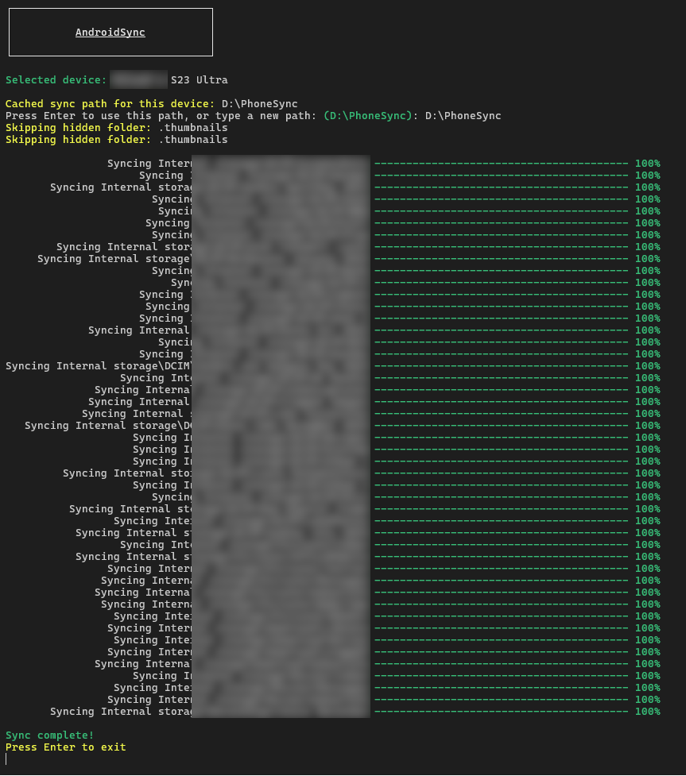

# AndroidSync

A simple Windows console app for syncing files from Android devices over USB.

## What it does

Connects to your Android phone and copies files from these folders to your PC:
- DCIM (photos/videos)
- Pictures (screenshots, etc.)
- Documents
- Download
- Movies
- Recordings

## Requirements

- Windows 10 or later
- Android device with USB debugging enabled or MTP mode
- USB cable

## Usage

1. Connect your Android device via USB
2. Run `AndroidSync.exe`
3. Select your device from the list
4. Choose where to sync files (or use the cached location)
5. Wait for sync to complete

The app saves your sync location for each device to ~/Documents/AndroidSyncConfig.json, so next time you can just hit Enter to use the same folder.

## License

MIT

